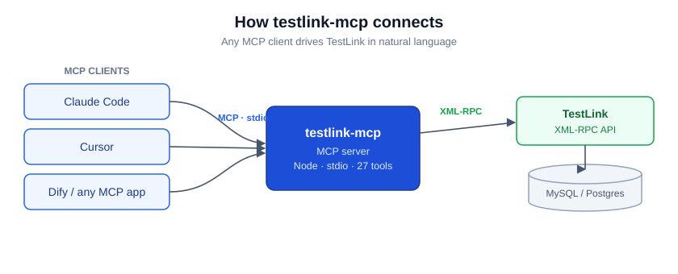
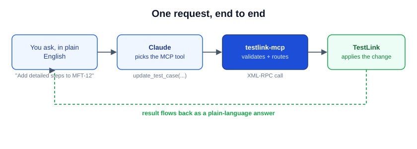
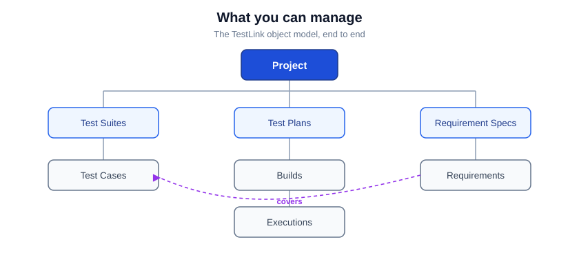

# TestLink MCP Server

**Run your TestLink test management from Claude — in plain English.**
Create suites, write and refine test cases, build test plans, record executions, and
link requirements, all through natural-language chat with any
[Model Context Protocol](https://modelcontextprotocol.io) client. No more clicking
through the TestLink UI.




---

## Why testlink-mcp?

TestLink is powerful but slow to drive by hand — every case edit, plan, and execution is
a trip through the web UI. testlink-mcp puts a clean **MCP server** in front of TestLink's
XML-RPC API so an AI assistant can do that work for you:

- **Talk, don't click.** *"Add detailed steps to MFT-12 and mark it high importance."*
- **Works with any MCP client** — Claude Code, Cursor, Dify, or your own.
- **27 tools across the whole TestLink model** — cases, suites, plans, builds, executions,
  requirements, projects.
- **Solid where it counts** — strict input validation, clear XML-RPC error mapping, and
  correct internal-vs-external ID handling so edits land on the right case.
- **One container to run it.** `docker run` and you're connected.

## How it works



You ask in plain language. Your MCP client (Claude) picks the right tool and arguments;
testlink-mcp validates them and makes the matching XML-RPC call to TestLink; the result
comes back as a plain-language answer. The server speaks MCP over **stdio** and TestLink
over **XML-RPC** — you only ever see the conversation.

## Quick Start

The published Docker image is the fastest way in.

**Claude Code**

```bash
claude mcp add testlink -- docker run --rm -i \
  -e TESTLINK_URL=http://your-testlink-host/testlink \
  -e TESTLINK_API_KEY=your_api_key_here \
  dogkeeper886/testlink-mcp:latest
```

**Cursor / other MCP clients** — add to your MCP config:

```json
{
  "mcpServers": {
    "testlink": {
      "command": "docker",
      "args": ["run", "--rm", "-i",
        "-e", "TESTLINK_URL=http://your-testlink-host/testlink",
        "-e", "TESTLINK_API_KEY=your_api_key_here",
        "dogkeeper886/testlink-mcp:latest"]
    }
  }
}
```

Then ask your assistant: *"List the test suites in project 1."*

> **Get your API key:** in TestLink, *My Settings → API interface → Generate key*, and
> make sure the XML-RPC API is enabled for your installation.

## What you can manage

testlink-mcp covers the full TestLink object model — the requirement that *covers* a case,
the case that lives *in* a suite and a plan, the build that *belongs to* a plan, and the
execution that *records* a result.



| Area | Tools |
|------|-------|
| **Test Cases** (4) | `create_test_case`, `read_test_case`, `update_test_case`, `delete_test_case` |
| **Test Suites** (5) | `create_test_suite`, `update_test_suite`, `delete_test_suite`, `list_test_suites`, `list_test_cases_in_suite` |
| **Test Plans** (5) | `create_test_plan`, `delete_test_plan`, `list_test_plans`, `add_test_case_to_test_plan`, `get_test_cases_for_test_plan` |
| **Builds** (3) | `create_build`, `close_build`, `list_builds` |
| **Executions** (2) | `create_test_execution`, `read_test_execution` |
| **Requirements** (7) | `create_requirement_specification`, `delete_requirement_specification`, `list_requirement_specifications`, `create_requirement`, `get_requirement`, `list_requirements`, `assign_requirements` |
| **Projects** (1) | `list_projects` |

## Reusable skills

On top of the raw tools, the repo ships three **Claude skills** — packaged workflows your
assistant invokes when you ask:

| Skill | What it does |
|-------|--------------|
| **`testlink-sync`** | Turns a source document — a spec, a GitHub issue, a folder of markdown test cases — into TestLink content: requirements, suites, cases, plans, builds. |
| **`testlink-review`** | Reads the written content back and verifies it met your goal — the right entities exist, fields are correct and well-formed. |
| **`testlink-format`** | The HTML markup reference for TestLink's rich-text fields, used by the other two. |

**To use them:** copy the skill folders from [`.claude/skills/`](.claude/skills/) into your
project's `.claude/skills/` (or `~/.claude/skills/` for every project), then just ask —
*"Sync the test cases in docs/tests/ into TestLink, then review them."*

## Configuration

| Variable | Required | Description |
|----------|----------|-------------|
| `TESTLINK_URL` | yes | Base URL of your TestLink instance (e.g. `http://host/testlink`) |
| `TESTLINK_API_KEY` | yes | Your TestLink API key (My Settings → API interface) |

The server exits immediately if `TESTLINK_API_KEY` is missing.

## Run from source

```bash
git clone https://github.com/dogkeeper886/testlink-mcp.git
cd testlink-mcp
npm install
npm run build
TESTLINK_URL=http://host/testlink TESTLINK_API_KEY=key node dist/index.js
```

## Troubleshooting

- **"Cannot connect to TestLink"** — check `TESTLINK_URL` is reachable from the container
  and that the XML-RPC API is enabled.
- **"Invalid API key"** — regenerate the key in TestLink and confirm API access is on for
  your user.
- **Edits hit the wrong case** — pass the external ID (`PREFIX-123`) or the numeric internal
  ID; the server routes each correctly.

## Project structure

```
testlink-mcp/
├── src/index.ts          # the MCP server (tools, handlers, XML-RPC client)
├── cicd/tests/           # end-to-end test runner + the dual-judge framework
├── .claude/              # dev-workflow + qa-workflow commands and skills
├── docs/                 # diagrams, stories, release notes
├── Dockerfile            # multi-stage node:20-alpine build
└── .env.example          # environment template
```

## Contributing

Issues and PRs welcome. The repo follows a gated dev-workflow (`.claude/commands/`);
the integration suite under `cicd/tests` must stay green.

## License

No license is published yet — please open an issue if you need licensing clarified before
use.

## Support

Questions and bugs: [GitHub issues](https://github.com/dogkeeper886/testlink-mcp/issues).
