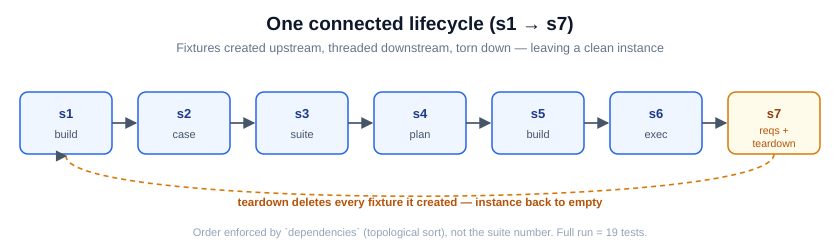
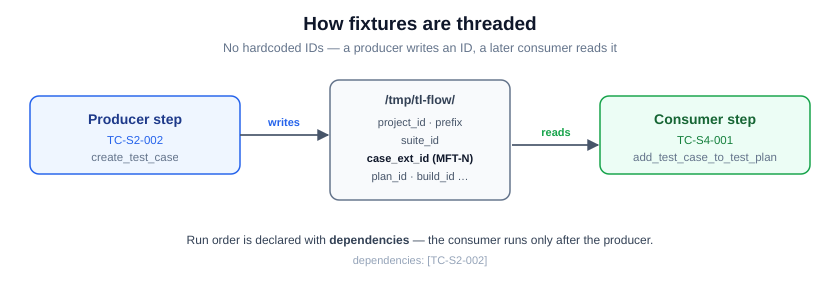
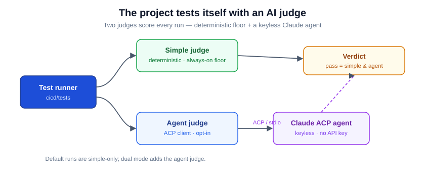

# Integration Test Framework

End-to-end tests for the TestLink MCP server. Each test spins up the **real**
`dist/index.js` over stdio (via `src/mcp-client.ts`), calls its tools against a **live**
TestLink, and judges the responses. Tests are declarative YAML under `testcases/`; the
runner internals live in `src/` (`cli.ts`, `executor.ts`, `loader.ts`, `judge/`,
`reporter/`).

## One connected flow

The suites are **not independent** — they are a single lifecycle. A small set of fixtures
(project → suite → case → plan → build → execution, plus a requirement that covers the
case) is **created once upstream and threaded downstream**, then torn down. No test
hardcodes an instance ID; no test re-bootstraps its own data. The suite number is its
position in the flow.



| Stage | What it does |
|-------|--------------|
| **s1** build & deploy | build the server, validate startup, build the Docker image (no TestLink data) |
| **s2** test case | provision project + suite; `create_test_case`; read; update by external **and** internal id (#80) |
| **s3** test suite | `list_test_suites` · `list_test_cases_in_suite` · `update_test_suite` |
| **s4** test plan | `create_test_plan` (reuse-or-create) + `add_test_case_to_test_plan` · `get_test_cases_for_test_plan` |
| **s5** build mgmt | `create_build` (left open for s6) + `list_builds` |
| **s6** execution | `create_test_execution` + `read_test_execution` |
| **s7** requirements | requirement spec + requirement → coverage; then **teardown**: close build → delete case/plan/req-spec/suite |

A full `cli.ts run` executes **19 tests** and passes against a **fresh** TestLink (only
precondition: the XML-RPC API is enabled), repeatably — CRUD is embedded *in* the flow,
not isolated, and teardown leaves only the empty project.

## How fixtures are threaded

Stages publish runtime IDs to small files under a shared scratch dir; later stages read
them. Ordering is declared with `dependencies` (topological sort), so the real order
follows the data, not the suite number.



```
/tmp/tl-flow/project_id · project_name · prefix · suite_id
             case_ext_id (MFT-N) · plan_id · build_id · reqspec_id · requirement_id
```

```yaml
# producer (TC-S2-002) writes case_ext_id; consumer (TC-S4-001) reads it
id: TC-S4-001
dependencies: [TC-S2-002]   # runs only after the case exists
```

## Test data

Every entity has a fixed name; all IDs are produced at runtime, never hardcoded.

| Entity | Name | Notes |
|--------|------|-------|
| Project | `MCP Flow Tests` (prefix `MFT`) | provisioned out-of-band by `flow-provision.ts` (project creation isn't an MCP tool) |
| Suite | `Flow Suite` | idempotent — reused by name |
| Case | `Flow Case` | author `admin` (built-in default user) |
| Plan | `Flow Plan` | idempotent (reuse-or-create) |
| Build | `Flow Build` | idempotent, left open for s6 |
| Req spec | `Flow Req Spec` (`FLOW-RS`) | idempotent |
| Requirement | `Flow Requirement` (`FLOW-REQ`) | idempotent; inside the spec |

Everything except the project is created through the MCP tools under test.

## Running

Requires a reachable TestLink with the XML-RPC API enabled.

```bash
cd cicd/tests
export TESTLINK_URL=http://localhost:8090
export TESTLINK_API_KEY=<key>

npx tsx src/cli.ts run                       # full flow (s1 → s7 + teardown)
npx tsx src/cli.ts run --suite s4-test-plan  # one suite (deps auto-included)
npx tsx src/cli.ts run --id TC-S2-002        # one test (deps auto-included)
npx tsx src/cli.ts list                      # list all tests
```

Suite shortcuts: `npm run test:s1` … `test:s7`. Results (JSON) land in
`cicd/results/<timestamp>_<suite>/`. To stand up a local TestLink, see the `testlink-code`
fork's docker-compose (TestLink on `:8090`).

## Judging



Every result is scored two ways:

- **Simple judge** (default): passes when every step exits 0, all `expectPatterns` match,
  no `rejectPatterns` match, and no `ERROR_PATTERNS` (`config.ts`) appear in the logs
  (minus `ERROR_EXCLUSIONS`, e.g. `isError`). The always-on correctness floor.
- **Agent judge** (opt-in, `JUDGE_MODE=dual`): an [Agent Client Protocol](https://agentclientprotocol.com)
  client that asks a Claude agent for a semantic verdict — catching silent failures exit
  codes miss. Dual-mode verdict = `simple && agent`.

```bash
JUDGE_MODE=dual npm test        # opt in the agent judge (env, not a flag)
```

| Env | Default | Meaning |
|-----|---------|---------|
| `JUDGE_MODE` | `simple` | `simple` = deterministic only; `dual` = also run the agent judge |
| `JUDGE_AGENT` | (bundled) | Command launching the ACP agent. Unset → the bundled Claude agent (`@agentclientprotocol/claude-agent-acp`). Point it at another ACP agent to swap models/vendors — **config, not code.** |

- **Keyless:** the default Claude agent authenticates via `~/.claude` locally or
  `CLAUDE_CODE_OAUTH_TOKEN` in CI — no `ANTHROPIC_API_KEY`. The model lives in the agent.
- **Fallback:** if the agent can't be reached or answer, the run falls back to the simple
  judge — the floor always holds.

## Adding a test

1. Pick the stage and `depend` on the producer of the IDs you need.
2. Read fixture IDs from `/tmp/tl-flow/*` — never hardcode project/suite/case IDs.
3. If your test creates a fixture, give it a **stable name** + idempotent reuse-or-create,
   publish its ID to `/tmp/tl-flow/`, and delete it in the teardown stage.
4. Each step `echo`s a marker (e.g. `READ_OK`) for `expectPatterns`; parse MCP JSON with
   `python3` rather than dumping raw responses (keeps the error scan clean).

**Don't:** hardcode instance IDs; bake IDs/random suffixes into fixture names; or
re-bootstrap the project/suite per test. The design rules live in the `agent-runner-flow`
skill.
